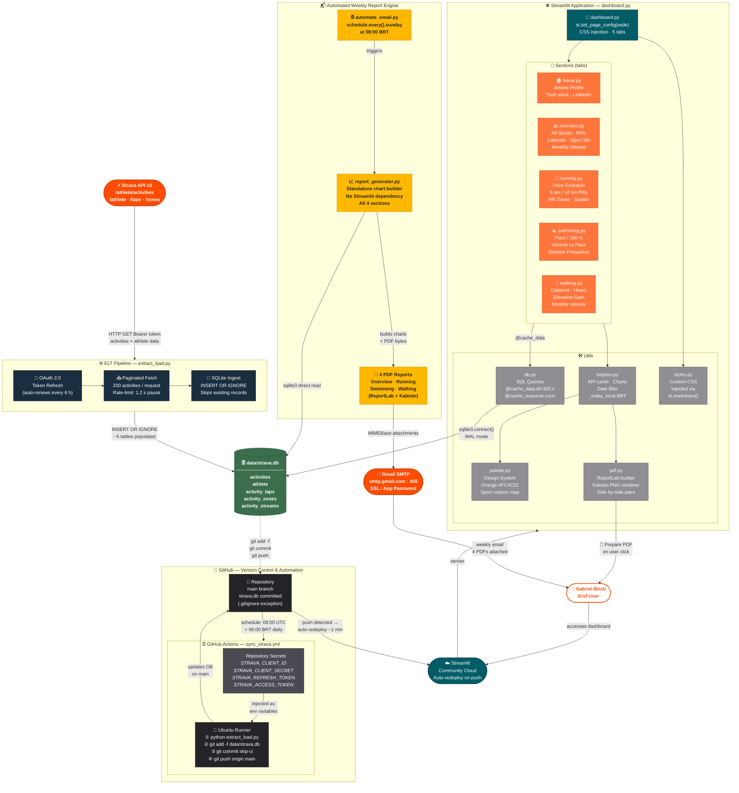

# Strava Performance Analytics — Architecture Diagram

Paste the Mermaid code below into **https://mermaid.live** → click **PNG** to export for LinkedIn.

```mermaid
flowchart TB
    %% ── Colour palette (Strava brand + section colours) ──────────────────────
    classDef ext      fill:#FC4C02,stroke:#c93800,color:#fff,font-weight:bold
    classDef pipeline fill:#1A2E40,stroke:#0f1c27,color:#fff
    classDef db       fill:#3B6E4C,stroke:#2a5138,color:#fff,font-weight:bold
    classDef gh       fill:#242428,stroke:#111,color:#fff
    classDef secret   fill:#4a4a52,stroke:#242428,color:#fff,font-style:italic
    classDef cloud    fill:#005C66,stroke:#003f47,color:#fff
    classDef section  fill:#FF763D,stroke:#c95020,color:#fff
    classDef util     fill:#8E8E93,stroke:#6a6a6e,color:#fff
    classDef report   fill:#FFB800,stroke:#c98f00,color:#242428,font-weight:bold
    classDef user     fill:#fff,stroke:#FC4C02,color:#FC4C02,font-weight:bold,stroke-width:2px

    %% ═══════════════════════════════════════════════════════════════════════
    %% LAYER 0 — External Services
    %% ═══════════════════════════════════════════════════════════════════════
    STRAVA(["⚡ Strava API v3\n/athlete/activities\n/athlete · /laps · /zones"]):::ext
    GMAIL(["📧 Gmail SMTP\nsmtp.gmail.com : 465\nSSL / App Password"]):::ext
    GABRIEL(["👤 Gabriel Biroli\nEnd User"]):::user

    %% ═══════════════════════════════════════════════════════════════════════
    %% LAYER 1 — ELT Pipeline (runs locally or via GitHub Actions)
    %% ═══════════════════════════════════════════════════════════════════════
    subgraph ELT["⚙️  ELT Pipeline — extract_load.py"]
        direction LR
        AUTH["🔐 OAuth 2.0\nToken Refresh\n(auto-renews every 6 h)"]:::pipeline
        FETCH["📥 Paginated Fetch\n200 activities / request\nRate-limit: 1.2 s pause"]:::pipeline
        INGEST["💾 SQLite Ingest\nINSERT OR IGNORE\nSkips existing records"]:::pipeline
        AUTH --> FETCH --> INGEST
    end

    %% ═══════════════════════════════════════════════════════════════════════
    %% LAYER 2 — Persistent Storage
    %% ═══════════════════════════════════════════════════════════════════════
    DB[("🗄️ data/strava.db\n──────────────\nactivities\nathlete\nactivity_laps\nactivity_zones\nactivity_streams")]:::db

    %% ═══════════════════════════════════════════════════════════════════════
    %% LAYER 3 — Version Control & CI/CD
    %% ═══════════════════════════════════════════════════════════════════════
    subgraph GITHUB["🔐  GitHub — Version Control & Automation"]
        REPO["📁 Repository\nmain branch\nstrava.db committed\n(.gitignore exception)"]:::gh
        subgraph ACTIONS["⏰  GitHub Actions — sync_strava.yml"]
            direction TB
            SECRETS["🔑 Repository Secrets\nSTRAVA_CLIENT_ID\nSTRAVA_CLIENT_SECRET\nSTRAVA_REFRESH_TOKEN\nSTRAVA_ACCESS_TOKEN"]:::secret
            RUNNER["🤖 Ubuntu Runner\n① python extract_load.py\n② git add -f data/strava.db\n③ git commit  skip-ci \n④ git push origin main"]:::gh
            SECRETS -->|"injected as\nenv variables"| RUNNER
        end
        RUNNER -->|"updates DB\non main"| REPO
    end

    %% ═══════════════════════════════════════════════════════════════════════
    %% LAYER 4 — Deployment
    %% ═══════════════════════════════════════════════════════════════════════
    CLOUD(["☁️ Streamlit\nCommunity Cloud\nAuto-redeploy on push"]):::cloud

    %% ═══════════════════════════════════════════════════════════════════════
    %% LAYER 5 — Streamlit Application
    %% ═══════════════════════════════════════════════════════════════════════
    subgraph APP["🌐  Streamlit Application — dashboard.py"]
        direction TB
        DASH["🏃 dashboard.py\nst.set_page_config(wide)\nCSS injection · 5 tabs"]:::cloud

        subgraph TABS["📑  Sections (tabs)"]
            direction LR
            T1["🏠 home.py\nAthlete Profile\nTech stack · LinkedIn"]:::section
            T2["📊 overview.py\nAll Sports · KPIs\nCalendar · Sport Mix\nMonthly Volume"]:::section
            T3["🏃 running.py\nPace Evolution\n5 km / 10 km PRs\nHR Zones · Scatter"]:::section
            T4["🏊 swimming.py\nPace / 100 m\nVolume vs Pace\nSession Frequency"]:::section
            T5["🥾 walking.py\nDistance · Hours\nElevation Gain\nMonthly Volume"]:::section
        end

        subgraph UTILS["🛠️  Utils"]
            direction LR
            DBUTIL["db.py\nSQL Queries\n@cache_data ttl=300 s\n@cache_resource conn"]:::util
            HELPERS["helpers.py\nKPI cards · Charts\nDate filter\n_today_local BRT"]:::util
            PALETTE["palette.py\nDesign System\nOrange #FC4C02\nSport colours map"]:::util
            PDFUTIL["pdf.py\nReportLab builder\nKaleido PNG renderer\nSide-by-side pairs"]:::util
            STYLES["styles.py\nCustom CSS\ninjected via\nst.markdown()"]:::util
        end

        DASH --> TABS
        TABS -->|"@cache_data"| DBUTIL
        TABS --> HELPERS
        HELPERS --> PDFUTIL
        HELPERS --> PALETTE
        DASH --> STYLES
    end

    %% ═══════════════════════════════════════════════════════════════════════
    %% LAYER 6 — Automated Report Engine
    %% ═══════════════════════════════════════════════════════════════════════
    subgraph REPORTING["📬  Automated Weekly Report Engine"]
        direction LR
        SCHEDULER["⏰ automate_email.py\nschedule.every().sunday\nat 08:00 BRT"]:::report
        RGEN["📈 report_generator.py\nStandalone chart builder\nNo Streamlit dependency\nAll 4 sections"]:::report
        PDFS["📄 4 PDF Reports\nOverview · Running\nSwimming · Walking\n(ReportLab + Kaleido)"]:::report
        SCHEDULER -->|"triggers"| RGEN
        RGEN -->|"builds charts\n+ PDF bytes"| PDFS
    end

    %% ═══════════════════════════════════════════════════════════════════════
    %% DATA FLOWS
    %% ═══════════════════════════════════════════════════════════════════════

    %% Extraction
    STRAVA -->|"HTTP GET Bearer token\nactivities + athlete data"| ELT
    ELT -->|"INSERT OR IGNORE\n~5 tables populated"| DB

    %% Manual local push
    DB -.->|"git add -f\ngit commit\ngit push"| REPO

    %% Automated daily sync
    REPO -->|"schedule: 09:00 UTC\n= 06:00 BRT daily"| ACTIONS

    %% Deploy pipeline
    REPO -->|"push detected →\nauto-redeploy ~1 min"| CLOUD
    CLOUD -->|"serves"| APP

    %% App reads DB
    DBUTIL -->|"sqlite3.connect()\nWAL mode"| DB

    %% PDF download in-app
    PDFUTIL -->|"🔄 Prepare PDF\non user click"| GABRIEL
    GABRIEL -->|"accesses dashboard"| CLOUD

    %% Weekly email reporting
    RGEN -->|"sqlite3 direct read"| DB
    PDFS -->|"MIMEBase attachments"| GMAIL
    GMAIL -->|"weekly email\n4 PDFs attached"| GABRIEL
```
